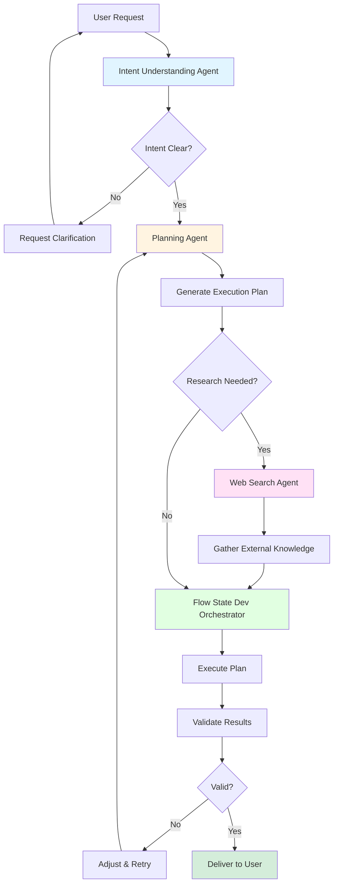

# Flow State AI

> An intent-driven, multi-agent system built on IBM watsonx Orchestrate

## 🚀 What Problem Does Flow State Solve?

Most AI assistants:
- ❌ Respond to prompts in isolation
- ❌ Lose context across turns
- ❌ Jump into solutions without understanding intent
- ❌ Hallucinate when external knowledge is required

**Flow State AI addresses this by:**
- ✅ Clarifying user intent before acting
- ✅ Planning explicitly before execution
- ✅ Using tools and research in a controlled manner
- ✅ Preserving context across agents and steps

The result is **lower rework**, **higher trust**, and **better alignment** with real-world workflows.

---

## 🧠 Architecture Overview

Flow State AI is built as a true agentic system with clear separation of responsibilities:

### Agents

#### 🎯 User Intent Understanding Agent
- Interprets explicit and implicit user goals
- Models expectations and likely user reactions
- Identifies ambiguity and missing information

#### 📋 Planning Agent
- Converts clarified intent into a structured execution plan
- Identifies steps, dependencies, risks, and validation points
- Does not execute actions

#### 🔍 Web Search Agent
- Performs controlled, tool-based web research
- Grounds decisions in up-to-date external information
- Reduces hallucinations

#### 🎭 Flow State Dev (Main Orchestrator)
- Coordinates all agents and tools
- Enforces execution order and safety rules
- Preserves and propagates context
- Produces the final user-facing output

> **Note:** Only the main orchestrator is allowed to invoke other agents or external tools.

---

## 🔁 Execution Pipeline

Flow State follows a deterministic pipeline that mirrors how experienced engineering teams work:



**Pipeline Stages:**
1. **Intent** → Understand what the user really wants
2. **Plan** → Design the approach before acting
3. **Research** → Gather external knowledge if needed
4. **Execute** → Carry out the plan with tools
5. **Validate** → Verify results meet expectations
6. **Deliver** → Present outcomes to the user

This prevents premature or unsafe actions and ensures alignment with user goals.

---

## 🛠️ Platform & Tooling

Flow State AI is built on **IBM watsonx Orchestrate**, which provides:

- Multi-agent definitions and coordination
- Tool access control and delegation
- Behavioral guidelines and guardrails
- Context continuity across turns
- Integration with external tools via **Model Context Protocol (MCP)**

External capabilities such as web search or source control (e.g., GitHub MCP) are accessed only through the orchestrator, ensuring **security** and **auditability**.

---

## 📚 Research Foundations and Inspirations

Flow State AI is grounded in established research on agentic systems and tool-augmented language models:

| Paper | Key Contribution | Link |
|-------|-----------------|------|
| **ReAct: Synergizing Reasoning and Acting in Language Models** (Yao et al., 2022) | Demonstrates that interleaving reasoning with actions improves reliability and interpretability | [📄 PDF](./research_papers/Yao_2022_ReAct.pdf) |
| **Tree of Thoughts: Deliberate Problem Solving with Large Language Models** (Yao et al., 2023) | Supports structured planning, branching, and validation for complex tasks | [📄 PDF](./research_papers/Yao_2023_Tree_of_Thoughts.pdf) |
| **SayCan: Grounding Language in Robotic Affordances** (Google Research, 2022) | Motivates separating high-level intent reasoning from executable actions | [📄 PDF](./research_papers/Google_2022_SayCan.pdf) |
| **Toolformer: Language Models Can Teach Themselves to Use Tools** (Schick et al., 2023) | Provides evidence that tool-augmented agents outperform purely generative models | [📄 PDF](./research_papers/Schick_2023_Toolformer.pdf) |
| **Tool Learning with Large Language Models: A Survey** (Chen et al., 2025) | Summarizes best practices, risks, and architectures for safe tool-using AI agents | [📄 PDF](./research_papers/Chen_2025_Tool_Learning_Survey.pdf) |
| **Orchestration of Multi-Agent Systems: Architectures, Protocols, and Enterprise Adoption** (Adimulam et al., 2026) | Establishes the importance of orchestration layers, context propagation, and governance | [📄 PDF](./research_papers/Adimulam_2026_Orchestration_MAS.pdf) |
| **Agentic Context Engineering** | Explores evolving contexts for self-improving language models | [📄 PDF](./research_papers/Agentic_Context_Engineering.pdf) |

These works motivate **intent-first design**, **planner–executor separation**, and **explicit orchestration layers**.

---

## 🎯 Use Cases

- 💻 Software design and feature planning
- 🐛 Debugging complex, context-heavy issues
- 🔬 Research-driven decision making
- ⚙️ Workflow orchestration and automation
- 🏆 Hackathon and enterprise AI demos

---

## 🧪 Status

This project was built as part of an **IBM hackathon** to demonstrate agentic AI using **watsonx Orchestrate**.

The system is designed to be:
- 🔧 **Extensible** – Easy to add new agents and tools
- 📊 **Auditable** – Clear execution traces and decision logs
- 🏢 **Production-aligned** – Built with enterprise governance in mind

---

## 📌 Key Principles

1. **Intent before execution** – Understand the goal before taking action
2. **Planning before action** – Design the approach explicitly
3. **Context never dropped** – Maintain continuity across all steps
4. **Tools used deliberately** – Not opportunistically or randomly
5. **Humans kept in flow state** – Minimize interruptions, maximize productivity

---

## 🚀 Getting Started

### Prerequisites
- IBM watsonx Orchestrate access
- Python 3.8+
- Required dependencies (see `requirements.txt`)

### Installation
```bash
git clone https://github.com/adityasasidhar/search-tools-for-my-watsonX-orchestrate.git
cd search-tools-for-my-watsonX-orchestrate
pip install -r requirements.txt
```

---

## 📝 License

This project is part of an IBM hackathon demonstration.

---

## 🤝 Contributing

This is a hackathon project, but feedback and suggestions are welcome!

---

**Built with ❤️ using IBM watsonx Orchestrate**